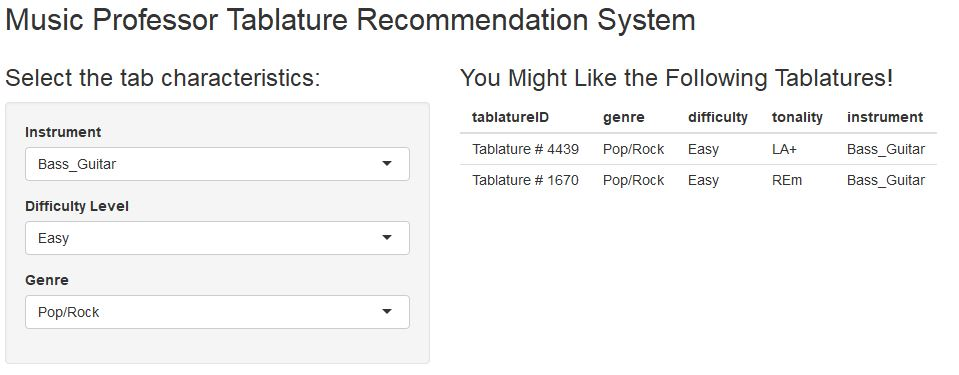

```{r setup, include=FALSE}
knitr::opts_chunk$set(echo = TRUE)

if(!"Matrix"%in%installed.packages()){install.packages("Matrix")}
library("Matrix")
if(!"matrixStats"%in%installed.packages()){install.packages("matrixStats")}
library("matrixStats")
if(!"recommenderlab"%in%installed.packages()){install.packages("recommenderlab")}
library("recommenderlab")

```

This document explains the business idea of a recommendation system for all levels of musicians who are in process of learning an instrument, just want to practice their skills, or learn a new song mainly in guitar or bass guitar.

The _Music Professor Recommender (MPR)_ seeks to have an extensive database of tablatures and cord sheets consisting of instrument exercises or complete songs for all levels and varied musical tastes. It works under a collaborative business model in which the community of users not only learn how to play, but also are encouraged to upload their tablatures for the rest of the community to learn from them.

Some of the main competitors of this industry are:

*	https://lacuerda.net/
*	https://www.ultimate-guitar.com/

## MPR Structure
MPR is a Tablature recommendation engine in which musicians are users and tablatures are the items to be recommended. Each Tablature has characteristics that help users identify them according to their preferences:

* Genre - Pop/Rock, Blues/Jazz, Reggae, or Metal
* Difficulty Level - Easy, Middle or Hard
* Instrument - Acoustic guitar, Electric Guitar or Bass Guitar
* Tonality

## Tailoring recommendations 
For the recommendation system to work, MPR not only will consider explicit data from users' ratings to tablatures, but also implicit data such as the search behavior, the time spent consulting and interacting with tablatures, and the timestamp in which each rating is given to a specific tab.

### Explicit Data Collection:
* Tablature Rating - Each user will be able to rate from 1 to 5 each tablature.

### Implicit Data Collection: 
Certain behaviors from users with the tool may help us identify the degree in which he/she likes a tablature. The following are some ideas of how implicit data can also help with the recommendation system:

* *Save tab into "My tablatures"* - MPF's users will be able to save the tabs into their sessions. This is a strong indicator of preference of a specific tab. 
* *Return Rate* - If a user consults a tab more than once, this means he liked the content.
* *Consumption time* - Another indicator of preference is the time spent consulting the tablature. The learning curve of a specific tab is slow at the beginning, and requires time. If the user is eager to learn it, he/she will spend time in the page.
* *Completion rate* - If the user reaches the end of the tab after a certain period of time, this may also be an indicator of preference. 

### Timestamp based recommender:
For this business model, a characteristic that may substantially improve the recommendations is having a time-sensitive collaborative filtering model. This relies in three main reasons:

* *Guitar Players improve over time:* Although the learning curve may differ among players, more complex tablatures may be recommended according to similar user's preferences, to challenge the musician's skills.
* *Users' preferences vary over time:* Considering that musical preferences may change with time, the recommender may give more importance to more recent tablatures that were rated/consumed. 
* *Seasonal recommendations:* During special dates such as Christmas, tabs and songs related to the season may be strongly recommended.

## Recommendation System creation
In the following section we describe the creation of the Rating Matrix and Tab-characteristic Database related to the business model described above. Considering that there is no available information related to this industry, the databases are created from scratch with random numbers. For this exercise, we will create a rating matrix that consists of 5000 tabs, 500 users and 5,000 ratings. Considering that in the final application the users will be able to filter according to Genre, Instrument and difficulty level, it's important to have an extensive number of ratings.

```{r}
#Creation of the Tablature rating matrix

nRatings <- 5000
nTabs <- 5000
nUsers <- 500

genres <- c("Pop/Rock", "Blues/Jazz", "Reggae", "Metal")
DifficultyLevel <- c("Easy","Middle", "Hard")
Instrument <- c("Acoustic_Guitar", "Electric_Guitar", "Bass_Guitar")
Tonality <- c("DO+","DOm", "RE+", "REm", "MI+", "MIm", "FA+", "FAm", "SOL+", "SOLm", "LA+", "LAm", "SI+", "SIm" )

set.seed(123)
RatingsMatrix <- data.frame(
  user=sample(nUsers, nRatings, replace=T),
  tablatureID= paste("Tablature # ",sample(nTabs, nRatings, replace=T)),
  rating=sample(5, nRatings, replace=T, prob = c(0.05, 0.15, 0.25, 0.45, 0.1 )),
  timestamp = sample(1000000000:1545264000, nRatings, replace = T)
  )

RatingsMatrix$user <- as.factor(RatingsMatrix$user)
RatingsMatrix$tablatureID <- as.factor(RatingsMatrix$tablatureID)
RatingsMatrix$rating <- as.numeric(RatingsMatrix$rating)
RatingsMatrix$timestamp <-as.numeric(RatingsMatrix$timestamp)

TablatureRatingMatrix <- as(RatingsMatrix, "realRatingMatrix")

# Creation of a Data Frame with the tab characteristics for posterior filtering in the recommender.
unique_tabs_ID <- unique(RatingsMatrix$tablatureID)

tabs_characteristics <- data.frame(tablatureID = unique_tabs_ID, 
                                   genre = sample(genres, length(unique_tabs_ID),replace = T),
                                   difficulty = sample(DifficultyLevel, length(unique_tabs_ID), replace = T),
                                   tonality = sample(Tonality, length(unique_tabs_ID), replace = T),
                                   instrument = sample(Instrument, length(unique_tabs_ID), replace = T)
                                   )

summary(tabs_characteristics)
head(tabs_characteristics)

```

Now that the rating matrix is created, the following is a general analysis of the dataset. As we can see, on average a user has rated 10 tablatures. The minimum number of ratings a user has evaluated is 2, while the maximum number of ratings by a user is 21.

As we can see in the histograms, the distribution of the ratings is slightly skewed to the left. (This happens considering that while creating the data, I gave more probability to a rating of 4 to simulate a more realistic dataset).

For the creation of the Recommendation Engine, it is important to normalize the data leaving for each user the average rating in zero. This way, we avoid the bias of extreme user ratings (some users tend to evaluate negatively all the tabs, while other users tend to do the same with positive ratings. 

```{r}
# Average number of rated tabs per user
mean(rowCounts(TablatureRatingMatrix))
# Minimum number of rated tabs by one user
min(rowCounts(TablatureRatingMatrix))
# Maximum number of rated tabs by one user
max(rowCounts(TablatureRatingMatrix))


# Distribution of the ratings
hist(getRatings(TablatureRatingMatrix), col = "darkred", main = "Ratings Distribution")
hist(getRatings(normalize(TablatureRatingMatrix, method = "Z-score")), main="Z-score Ratings Distribution", col = "Red")

# Distribution of how many tablatures each user has rated
hist(rowCounts(TablatureRatingMatrix), breaks = 10, main = "Histogram Rated Tablatures by user", col = "lightBlue")

# Distribution of the average ratings per tablature
hist(colMeans(TablatureRatingMatrix), main = "Histogram Average Rating per Tablature", col = "lightGreen")

```

The following rating matrix helps us have a quick grasp of the sparse rating matrix that we are dealing with.

```{r}

image(getRatingMatrix(TablatureRatingMatrix), main="Rating Matrix Heatmap", xlab = "Tablatures", ylab="Users")

```

### Defining the evaluation scheme

There are different algorithms that can be applied the recommendation system. In this section, I will test and compare the performance of a Random recommender system, Popular, User Based Collaborative Filtering with 20 nearest neighbors, and Item Based Collaborative Filtering with Pearson distance measure to k = 10 neighbors. 

As we can see in the ROC curve, the *UBCF* and *IBCF* do not show a positive performance. This happens considering the randomness of the data when created. According to the ROC curve, the *Random* Recommendations show the best performance. However, from a business perspective, it makes more sense to use an *Item Based Collaborative Filtering* recommender, as will be developed in further steps. 

The *IBCF* will be developed in view that user profiles may change quickly during time while improving in an instrument. With *IBCF* the entire system will not have to be recomputed, as opposed to a *UBCF.* This leads to a more stable rating distribution in the model with fewer recalibrations of the model.

```{r}

set.seed(123)
Multi_evaluate <- evaluationScheme(TablatureRatingMatrix, method = "split", train=0.9, given = 1, goodRating = 4)

algorithms <- list(
  "random" = list(name="RANDOM", param=NULL),
  "popular" = list(name="POPULAR", param=NULL),
  "User Based CFnn20" = list(name="UBCF", param=list(nn=20)),
  "Item Based CFPea" = list(name="IBCF", param=list(method = "Pearson", k=10))
)

Multi_results <- evaluate(Multi_evaluate, 
                          method = algorithms, 
                          type = "topNList", 
                          parameter = list(normalize = "Z-Score"),
                          n=c(1, 5, 10, 20))

plot(Multi_results, annotate=c(1,2), legend = "topleft")

ratings_results <- evaluate(Multi_evaluate, algorithms, type = "ratings")

plot(ratings_results)

```

#### Hybrid Recommender
In this section, we build a *Hybrid Recommender 30% Popular based and 70% Item Based Collaborative Filtering*. The Popular Recommender is taken into consideration with the objective of boosting recommendations of tablatures that appear to be popular in the last year (using the timestamp property). Musicians may be enthusiastic in learning the songs that became popular in the last year.

For the purpose of this exercise, the algorithm is trained with the first 450 users of the Rating Matrix and the prediction will be applied for the user in the position 451.

```{r}

Train_set <- TablatureRatingMatrix[1:450,]
Train_set_popular <- subset(RatingsMatrix, RatingsMatrix$timestamp > (Sys.time()-(365*24*60*60)))
Train_set_popularRS <- as(Train_set_popular,"realRatingMatrix")

# Recommender Popular
#Popular_rec <- Recommender(Train_set_popularRS, method="POPULAR")
Popular_rec <- Recommender(Train_set, method="POPULAR")
# Recommender IBCF
IBCF_rec <- Recommender(Train_set, method = "IBCF", parameter = list(k=10, method = "Pearson"))

# Hybrid Recommender
Hybrid_rec <- HybridRecommender(Popular_rec, IBCF_rec, weights = c(0.3,0.7))

Popular_predict <- predict(Popular_rec, newdata = TablatureRatingMatrix[451,], n=5)
as(Popular_predict, "list")

Hybrid_predict <- predict(Hybrid_rec, newdata = TablatureRatingMatrix[451,], n=20)
as(Hybrid_predict, "list")

```

#### Filtering recommendations
Now that the recommendation system is built, to improve the users' experience, we will create an application where the users will be able to filter the recommendation according to their instrument, level and music tastes. The following function will be used in the Shiny app to display the recommendations related to the user's preferences.

```{r}
prediction_list_id <- as(Hybrid_predict, "list")
prediction_vector <- unlist(prediction_list_id)

tab_recommendation <- function(input_instrument, input_difficulty, input_genre){
  #tabs_subset <- subset(tabs_characteristics, 
   #                     genre == input_genre & 
    #                      difficulty == input_difficulty & 
     #                     instrument == input_instrument)
  
  #rating_matrix_subset <- subset(RatingsMatrix, 
   #                              RatingsMatrix$tablatureID %in% tabs_subset$tablatureID)
 
  #Tab_rating_matrix <- as(rating_matrix_subset, "realRatingMatrix")
  
  tabs_subset <- subset(tabs_characteristics, 
                        genre == input_genre & 
                          difficulty == input_difficulty & 
                          instrument == input_instrument &
                          tabs_characteristics$tablatureID %in% prediction_vector)
  
  return(head(tabs_subset, n=5))
  }
```

As can be seen in the following image, the users may filter the type of tablture they want to consult according to the instrument they play, the difficulty level and their genre of interest.



To use the shiny app please open the file *Tab_RecommenderApp.R* 

## Conclusions
In this project, a tablature recommendation system was developed for the community of musicians who want to practice and improve their playing skills. This recommendation system is just an initial prototype with a proposal that considers mainly the following:

* Explicit and Implicit Data Collection
* Hybrid Recommender: IBCF (for stability and easier scalability for new users) + Last Year Popularity (Timestamp usage)
* Seasonal timestamp recommendations
* Recommendation Filtering (Genre, Instrument, Difficulty Level)

All these properties of the Recommendation System seek to enhance the user experience and offer the best recommendations for a growing usage of the tool.

